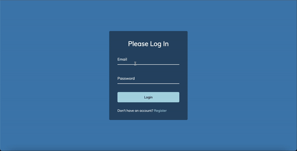

# Styling The Form
This project is a demonstration of styling a form using HTML and CSS. It showcases various CSS techniques to enhance the appearance and user experience of a web form.

## Preview

## Features

- Responsive design
- Interactive form validation

## Technologies Used

- HTML
- CSS

## Getting Started

To view the project locally, follow these steps:

1. Clone the repository.
2. Navigate to the project directory.
3. Open the index.html file in your web browser.

## Acknowledgement

The project is part of the "50 projects in 50 days - HTML, CSS & Javascript" course on Udemy by Brad Traversy.
